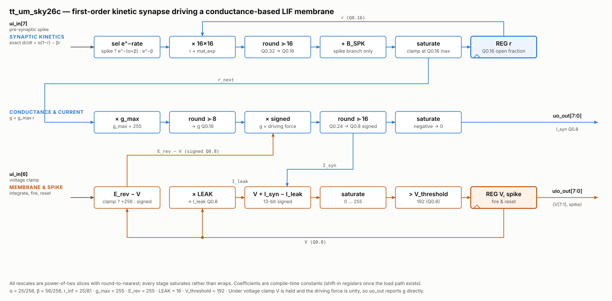

<!---

This file is used to generate your project datasheet. Please fill in the information below and delete any unused
sections.

You can also include images in this folder and reference them in the markdown. Each image must be less than
512 kb in size, and the combined size of all images must be less than 1 MB.
-->

## How it works



A discrete-time first-order kinetic (Markovian) synapse driving a leaky
integrate-and-fire membrane.

The receptor state `r` — the fraction of open post-synaptic receptors — follows
`dr/dt = alpha*(1-r) - beta*r`, integrated with the exact (closed-form) solution
rather than forward Euler, so it is stable at any timestep. One 16x16 multiply
covers both branches; only the steady-state offset differs:

- pre-synaptic spike high: `r <- r*e^-(alpha+beta) + r_inf*(1 - e^-(alpha+beta))`
- pre-synaptic spike low:  `r <- r*e^-beta`

with `alpha = 25/256`, `beta = 56/256`, `r_inf = alpha/(alpha+beta) = 25/81`.
The three coefficients are stored as their exponentials in Q0.16, not as rates.

Conductance is `g = g_max * r`, and the synaptic current is
`I_syn = g * (E_rev - V)` -- signed, so it always pulls `V` toward the reversal
potential rather than away from it. That current, less a linear leak term,
integrates the membrane potential `V`. `E_rev` sits above `V_threshold`, making
the synapse excitatory; putting it below threshold would make it inhibitory,
and the signed path handles that without change. When `V` crosses `V_threshold` the neuron fires: the
spike output asserts for one cycle, and `V` resets to zero on the *following*
cycle rather than the same one. The crossing value is therefore observable on
the V readout instead of being overwritten, and the neuron gets a one-cycle
refractory period -- the spike output can never stay high for two cycles.

`r` and everything derived from it are unsigned Q0.16; `V`, `E_rev` and the leak
are unsigned Q0.8. Every rescale is a power-of-two slice with round-to-nearest,
never a divider, and each stage saturates instead of wrapping. `r` carries the
extra width because a slow tau otherwise decays by less than half an LSB of
Q0.8, which would latch the state instead of relaxing it.

### Coefficient load port

All three kinetic coefficients — `MAT_EXP_SPK`, `MAT_EXP_NSPK` and `B_SPK` —
live in a 48-bit shift register rather than in constants. There is no room in
the pin budget to stream 16 bits per cycle, so they are clocked in one bit at a
time on `ui[0]` (`cfg_din`) while `ui[1]` (`cfg_shift`) is high, MSB first:
`MAT_EXP_SPK`, then `MAT_EXP_NSPK`, then `B_SPK`, 48 cycles in total.

While `cfg_shift` is high the neuron state (`r`, `V`, `spike`) is frozen, so a
load takes no simulated time from the trace either side of it and a
partially-shifted word is never applied to a live update.

Reset clears the chain to zero, and an all-zero field selects the hand-computed
default for that coefficient, independently of the other two. Zero is not a
usable value for any of them — a zero `MAT_EXP` collapses `r` every cycle, and a
zero `B_SPK` makes the spike input inert — so spending it as the "never loaded"
sentinel costs nothing.

### Voltage clamp

With `voltage_clamp` high, `V` is held and the driving force is replaced by
unity, so `uo_out` reports the conductance waveform directly. This is a
measurement mode for characterizing the kinetics, not a physiological clamp at a
command potential.

### Readout note

`uo_out` is unsigned, so an inhibitory (negative) synaptic current reads as 0 on
the pin. The membrane update itself uses the signed value.

## How to test

Simulation runs from `test/` with cocotb and Icarus:

```sh
cd test
make -B
```

Note that `make` exits 0 even when assertions fail — check `results.xml` for
`failure` rather than the exit code.

The suite covers the impulse response (one spike, then free decay), continuous
drive to the saturating steady state, the rest condition (no input, current must
stay at zero), and unclamped firing. It also checks the load port both ways:
shifting in the default coefficients must reproduce the unconfigured trace
sample for sample, and perturbing each of the three fields in turn must move the
part of the waveform that field governs. It writes current traces, a spike
raster, and side-by-side comparisons of the two shift-in runs — one of `I_syn`,
one of `V` — to `test/output/`.

To drive the design directly: hold `ui[7]` high for the cycles a pre-synaptic
spike is present, and set `ui[6]` to choose clamped (conductance readout) or
unclamped (full membrane dynamics) mode. Leave `ui[1:0]` at zero to run on the
default coefficients. All inputs arrive on `ui_in`, so the
bidirectional bus is driven as output at all times.

`uo_out` carries the synaptic current in Q0.8. `uio_out` carries
`{V[7:1], spike}`: bit 0 is the post-synaptic spike, and bits 7:1 are the
membrane potential with its least significant bit dropped. V therefore reads
back only to even Q0.8 codes -- half its internal resolution -- so a reader
should add half a step to centre the quantization error at +/-0.5 LSB rather
than biasing every sample low.

## External hardware

None.

## References

1. Destexhe, A., Mainen, Z. F., & Sejnowski, T. J. (1998). Kinetic models of
   synaptic transmission. In C. Koch & I. Segev (Eds.), *Methods in Neuronal
   Modeling* (2nd ed., pp. 1–25). MIT Press.
   — the first-order kinetic scheme this design implements.

2. Rotter, S., & Diesmann, M. (1999). Exact digital simulation of time-invariant
   linear systems with applications to neuronal modeling. *Biological
   Cybernetics*, 81(5–6), 381–402.
   — the exact discretization used instead of forward Euler.
